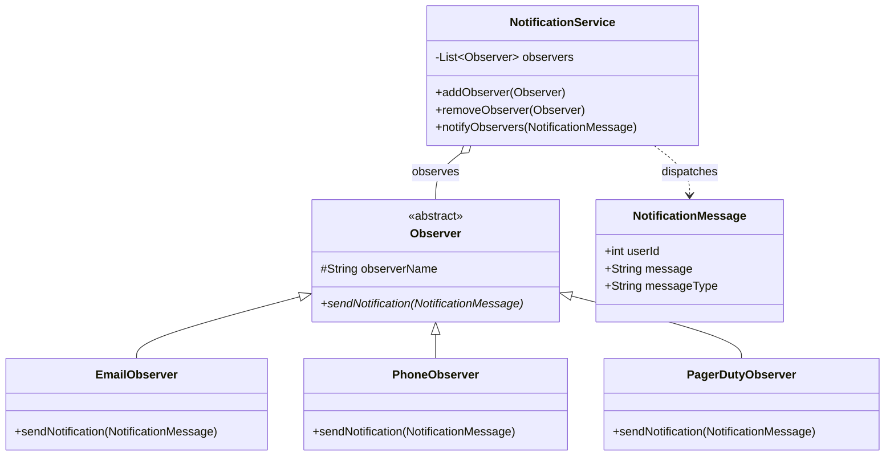

# Notification Service — Observer Pattern

A clean, extensible **Notification System** built in Java demonstrating the **Observer (Pub/Sub) design pattern** — a common system design component at companies like Amazon, Google, and Meta (think: SNS, Firebase Cloud Messaging, PagerDuty alerting pipelines).

---

## Problem Statement

Design a notification service that can send alerts across **multiple channels** (Email, SMS, PagerDuty) whenever an event occurs — without the core service being tightly coupled to any specific channel. New channels must be addable with **zero changes** to existing code.

---

## Design Pattern: Observer

| Role | Class | Responsibility |
|---|---|---|
| Subject | `NotificationService` | Maintains observer list; triggers notifications |
| Abstract Observer | `Observer` | Defines the `sendNotification` contract; shared base for all channels |
| Concrete Observers | `EmailObserver`, `PhoneObserver`, `PagerDutyObserver` | Channel-specific delivery logic |
| Event/Message | `NotificationMessage` | Payload carrying userId, message, and type |

---

## Architecture



---

## How It Works

```
NotificationService
      │
      ├── addObserver(EmailObserver)
      ├── addObserver(PhoneObserver)
      └── addObserver(PagerDutyObserver)
            │
            └── notifyObservers(message)
                    ├── EmailObserver.sendNotification()
                    ├── PhoneObserver.sendNotification()
                    └── PagerDutyObserver.sendNotification()
```

1. Observers register themselves with `NotificationService`.
2. When an event fires, `notifyObservers()` iterates the observer list and calls `sendNotification()` on each.
3. Adding a new channel (e.g., Slack, WhatsApp) requires **only a new class** — no changes to `NotificationService`.

---

## Run Locally

**Prerequisites:** Java 8+

```bash
# Compile all files
javac *.java

# Run
java main
```

**Expected Output:**
```
Email Notification sent to userId: 1 with message: Hello World and messageType: Greeting
Phone Notification sent to userId: 1 with message: Hello World and messageType: Greeting
PagerDuty Notification sent to userId: 1 with message: Hello World and messageType: Greeting
```

---

## Extending the Service

Adding a new notification channel takes **one file and zero modifications** to existing code — this is the **Open/Closed Principle** in action:

```java
public class SlackObserver extends Observer {
    public SlackObserver(String observerName) {
        super(observerName);
    }

    @Override
    public void sendNotification(NotificationMessage message) {
        System.out.println("Slack alert → userId: " + message.userId
            + " | " + message.messageType + ": " + message.message);
    }
}
```

Then register it:
```java
notificationService.addObserver(new SlackObserver("Slack"));
```

---

## Design Principles Applied

| Principle | How |
|---|---|
| **Open/Closed** | Add channels without touching `NotificationService` |
| **Single Responsibility** | Each observer owns exactly one delivery channel |
| **Dependency Inversion** | `NotificationService` depends on the `Observer` abstraction, not concrete classes |
| **Liskov Substitution** | Any `Observer` subtype can be registered and notified uniformly |

---

## Related Real-World Systems

| System | Pattern Used |
|---|---|
| Amazon SNS | Fan-out to SQS, Lambda, HTTP endpoints |
| PagerDuty | Event-driven alerting with routing rules |
| Firebase Cloud Messaging | Topic-based push to multiple device observers |
| Apache Kafka | Producers/consumers as Subject/Observer at scale |

---

## Author

**Shani Jaiswal** — Built as part of a system design + low-level design interview preparation series.
